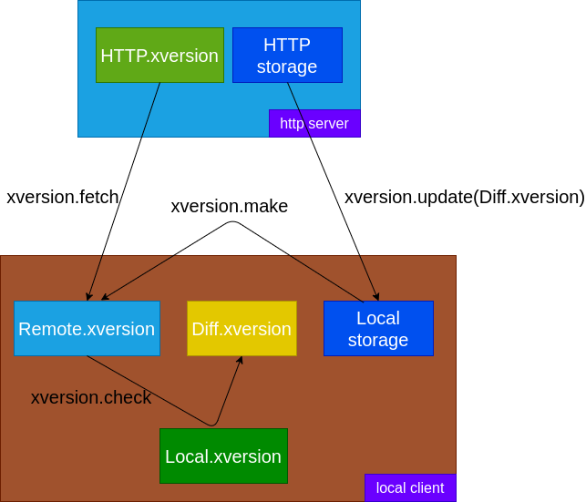

## 简介

xversion 致力于提供一套客户端与 http 服务器同步的一套方案。

## 结构图





## API 设计

### 初始化

xversion.init (remote_storage_url, remote_version_url, local_storage_path, local_version_file)

### 同步远端版本

xversion.fetch()

### 检查本地目录

xversion.check_path(local_path)

### 检查包

xversion.check_pkg(pkg_name)

### 检查 tags

xversion.check_tags(tags)

### 更新本地目录

xversion.update_path(local_path)

### 更新包

xversion.update_pkg(pkg_name)

### 更新 tags

xversion.update_tags(tags)

### 停止更新

xversion.stop()

## 配置文件设计

### xversion

```json
{
	"pkg" : "hall",
	"language" : "all",
	"tags" : ["tag1", "tag2"]
}
```


### [remote|local].xversion

```json
[
	{
		"path" : "/",
        "md5" : "aed002034",
        "pkg" : "hall",
        "language" : "cn",
        "tags" : ["tag1", "tag2"]
	},
	{
		"path" : "/hall/",
        "md5" : "aed002034",
        "pkg" : "hall",
        "language" : "cn",
        "tags" : ["tag1", "tag2"]
	},
    ...
]
```

## 工具

### xversion init

初始化本地目录配置

### xversion fetch

获取最新配置

### xversion check

检查某个 [**目录**|**PKG**|**tag**] 更新

### xversion update

更新 [**目录**|**PKG**|**tag**] 

### xversion make

生成 [remote|local].xversion 文件